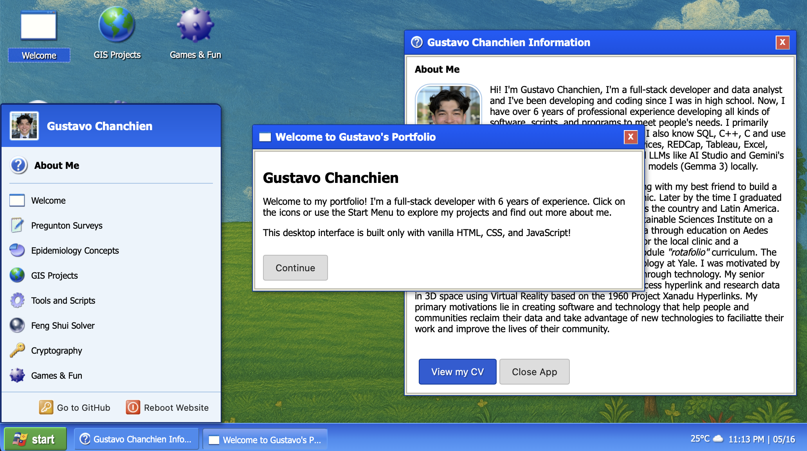

# Portfolio XP Desktop - Gustavo Chanchien

This is my interactive creative portfolio, I designed it as a nostalgic Windows XP-style desktop envinronment to showcase some of my front-end development experience and as a fun project. It's made completely with vanilla Javascript, HTML, and CSS in a single html document.

## Live Demo

**`https://gustavochanchien.github.io`**

## Overview

I built this portfolio so it would be a fun immersive desktop simulation and to hold all my projects. It features a fake boot screen, draggable icons that move and resize with the actual window size, launchable "applications", a working start menu, and a taskbar that has the time, date, and weather updates (fetched from the IP address). The "applications" are all stored in an array so I can easily add and edit them as I add projects. 

## Features

### User Interface & Experience:
* **Windows XP Inspired Design:** A parody recreation of the classic Windows XP aesthetic.
* **Boot Screen Simulation:** A skippable (after first visit) boot sequence with loading animation.
* **Interactive Desktop:**
    * Draggable application icons.
    * Icon selection and hover effects.
    * Icons move around to fit the window and resize when appropriate
    * Desktop area simulated selection box.
* **Functional Taskbar:**
    * XP-style Start Button and menu.
    * Displays and manages open application "windows." in taskbar
    * Real-time clock and dynamic weather display.
* **Start Menu:**
    * Lists available "applications" (projects, about me, etc.).
    * "Reboot Website" functionality.
* **Draggable & Closable Windows:**
    * Application windows can be moved around the desktop.
    * Each window has a title bar with icon, title, and a close button.
    * Content for each "application" is dynamically loaded.
* **Dynamic Content:**
    * Weather information based on the user's approximate location (via IP geolocation).
    * User's IP and approximate location displayed in an info popup.

### Technical Highlights:
* **Vanilla JavaScript Core:** The entire desktop interaction logic, window management, and dynamic content loading are handled with plain JavaScript, without relying on external UI frameworks for the desktop simulation.
* **Modular Application Structure:** "Applications" are defined in a central JavaScript array (`applicationsData`), making the portfolio easily extensible with new projects or sections.
* **Dynamic DOM Manipulation:** Icons, windows, start menu items, and taskbar entries are created and managed programmatically.
* **CSS Sprite for Icons:** Efficiently loads and displays all UI icons (desktop, window title bars, start menu, taskbar) from a single sprite sheet, with positions and scaling calculated in JavaScript.
* **API Integration:**
    * Asynchronously fetches data from `api.ipify.org` (IP address), `ip-api.com` (geolocation), and `api.open-meteo.com` (weather).
* **Comprehensive Event Handling:** Manages user interactions like clicks, double-clicks, drag-and-drop, and mouse movements.
* **Z-Index Management:** Dynamically assigns `z-index` values to ensure active windows are always on top.
* **Responsive Icon Layout:** Desktop icons are dynamically scaled and arranged based on the available viewport space, with debounced updates on window resize.
* **`localStorage`:** Used to manage the boot screen visibility state.

## Technologies Used

* **HTML5**
* **CSS3** (Flexbox, Gradients, Custom Properties, Animations)
* **Vanilla JavaScript (ES6+)**

## How It Works

The webpage initializes by checking `localStorage` to determine if the boot screen should be displayed. Once the desktop environment is loaded:
1.  **Applications Data (`applicationsData`):** A JavaScript array holds objects, each defining an "application" with its ID, name, icon index (for the sprite sheet), and the HTML content for its window.
2.  **Desktop Initialization:**
    * Icons are dynamically created and positioned on the desktop based on `applicationsData` and available screen space.
    * Application windows are created (initially hidden).
    * The Start Menu is populated.
3.  **Interactivity:** Event listeners handle all user actions:
    * Dragging icons or windows updates their `position` style.
    * Clicking/double-clicking icons or Start Menu items opens the corresponding window.
    * Opening a window also creates a taskbar item for it.
    * Window `z-index` is managed to bring the most recently interacted window to the front.
4.  **Dynamic Information:**
    * The clock updates every second.
    * IP, location, and weather data are fetched on load and periodically refreshed.
    * Icon graphics are rendered using a CSS sprite sheet; JavaScript calculates the `background-position` and `background-size` to display the correct portion of the sprite.
---

This project was a fun challenge to use modern web technologies to recreate a nostalgic expereince. I hope you enjoy exploring it!